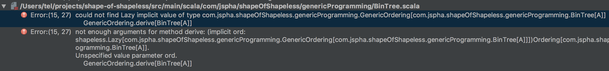
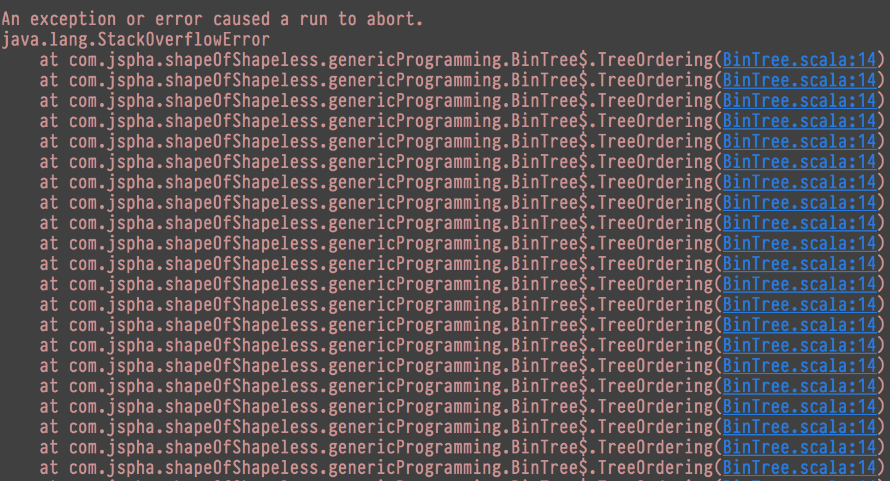

autoscale: true
footer: The Shape of Shapeless, Joseph Abrahamson, LambdaConf 2018
slidenumbers: true

# The Shape of _Shapeless_

### Joseph Abrahamson

### LambdaConf 2018


---


^ So this is what I'm talking about

---



^ But you may have seen it before looking like this

---

> **Shapeless** is a Scala library for type-level and compile-time generic programming

---

**Type-level Programming**

Constructing programs which execute at compile time taking _types_ as input and returning as output both new types and _runtime functionality_.

--- 

**(Compile time) Generic Programming**

Programs which treat data _structurally_ instead of _nominally_ and thus are defined to work over classes of types which look similar even if they aren't actually related.

(And all done at compile time; _no reflection!_)

---

> Shapeless is a Scala library for creating inscrutible function signatures and error messages :dizzy_face:

---

> The Shape of Shapeless

^ I want to provide enough pieces for you to pierce the veil and start to really understand what's going on.

---
[.build-lists: true]

Shapeless is

- Using **_rich_ type-level information**...
- via the technique of **type-level programming**...
- to perform compile-time **generic programming**.

---

It's very likely that _all_ of these are foreign topics.

So...

---

# Outline

1. Motivation
2. Representing _rich_ type information
3. Type-level programming techniques
4. Generic programming

---

# 1. Motivation

---

## `(Double, Double)` versus `Point2d`

---

```scala
final case class Point2d(x: Double, y: Double)
```

---

```scala
final case class Point2d(x: Double, y: Double) {

  // Domain-specific functionality
  def translate(vec: Vector2d): Point2d = ...

}
```

---

```scala
final case class Point2d(x: Double, y: Double) {

  // Domain-specific functionality
  def translate(vec: Vector2d): Point2d = ...

  // Pretty generic functionality
  def compare(other: Point2d): Int = ...

}
```

---

```scala
// Very generic definition
implicit def LexicographicOrd[A: Ordering, B: Ordering]: Ordering[(A, B)] = ...
```

---

**Question** Why can't we use this `Tuple2` instance to define ordering for `Point2d`? 

It's _nominally_ invalid for `Point2d` to subclass `(Double, Double)`

---

:point_right: But, it's _structurally_ valid to see `Point2d` as just being a `(Double, Double)`.

---

```scala
final case class Point2d(x: Double, y: Double) {

  def toTuple: (Double, Double) = (x, y)

  def compare(other: Point2d): Int = {
    val lexico = implicitly[Ordering[(Double, Double)]
    lexico.compare(toTuple, other.toTuple)
  }

}
```

---

Compile-time generic programming lets us do exactly this as a one-liner. 

(Or even just automatically for all valid types.)

---

In fact, we will do it later today.

---

_(Actually, we'll generalize it to work on case classes of_ any _arity._

_Even greater than 22.)_

---

> Circe: a popular JSON serialization library.

---

```scala
final case class MyType(...)

object MyType {

  // These lines use Circe methods to "derive" 
  // encoders and decoders for our case class
  // using _structural_ information

  implicit val circeEncoder: Encoder[MyType] =
    semiauto.deriveEncoder[MyType]

  implicit val circeDecoder: Decoder[MyType] =
    semiauto.deriveDecoder[MyType]

  // Uses Shapeless to achieve this functionality

}
```

---

# 2. Representing _rich_ type information with `HList`


---

**`HList` is a "heterogenously typed list"**

---

Not

```scala
val x: List[Any] = List(
  1, 2, 3
  true, false,
  "foo", "bar", "baz"
)
```

which is _homogenously_ and _uninformatively_ typed

---

More like

```scala
val x: (Int, Boolean, String, String, List[Int]) = 
  ( 3,
    true,
    "foo", "bar",
    List(1, 2, 3)
  )
```

which is full of _rich_ type information, 5 different types!

---
[.build-lists: true]

What's wrong with tuples?

- No direct relationship between `TupleN` and `Tuple(N+1)` or `Tuple(N-1)`
- `Unit` is also a tuple, a `Tuple0`
- To write functionality for "all tuples" we need to write 22 separate instances of it :sob:
- Oh, and we can only go up to arity 22

---

A different kind of Tuple

```scala
val x: (Int, (Boolean, (String, (String, (List[Int], ()))))) = 
  ( 3,
    ( true,
      ( "foo",
        ( "bar",
          ( List(1, 2, 3),
            ( ) ) ) ) ) )
```

---

A different kind of Tuple

```scala
val x: Int :: Boolean :: String :: String :: List[Int] :: HNil = 
  3 ::
    true ::
      "foo" ::
        "bar" ::
          List(1, 2, 3) ::
            HNil
```

---

A different kind of Tuple

```scala
val x: Int :: Boolean :: String :: String :: List[Int] :: HNil = 
  3 :: true :: "foo" :: "bar" :: List(1, 2, 3) :: HNil
```

---

```scala
sealed trait HList

// A type like Unit
sealed trait HNil extends HList

// A value like ()
object HNil extends HNil

// A type and value like Tuple2
final case class ::[+Head, +Tail <: HList](
  head: Head,
  tail: Tail
) extends HList
```

---

**Recap**

- "Heterogenous" lists with `Any` ain't no kind of heterogenous list
- Tuples create _rich_ heterogenous types, but lack a recursive structure
- `HList` is "just" `Unit` and `Tuple2` with a common supertype

---

**Next up** we'll write functions which exploit the "rich" type information in an `HList` to do interesting _type-level programming_.

---

# 3. Type-level programming on `HList`s


---

> `HList`s are great and all, but you can't do much with them.

---

If we want to write functionality that works for HLists generally... 

then we need to be able to write something that's sensitive to complex types.

---

```scala
// Is this a reasonable signature?
def concat(a: HList, b: HList): HList

// Is this any better?
def concat[A <: HList, B <: HList](a: A, b: B): HList

// The output type has lost all its interesting structure.
// We need to ensure that it's related to A and B... somehow?
```

---

We need type-level programming techniques.

---

An example

```scala
speak(“foo” :: “bar” :: 3 :: 2 :: 1 :: Seq(1, 2, 3) :: HNil)

// => “foo” :: “bar” :: “3” :: “2” :: “1” :: Seq(1, 2, 3) :: HNil
```

a type level _mapping_ operation taking `Int`s to `String`s.

---

All type-level programming begins with a `trait`...

---

```scala
trait Speak[-In <: HList] {
  type Out <: HList
  def apply(in: HList): Out
}
```

---

Type parameters are _type inputs_ and type members are _type outputs_.

---

*Key insight* We'll create a small DSL for constructing `Speak` values at any type we're interested in.

---

```scala
val SpeakHNil: Speak[HNil] =
  new Speak[HNil] {
    type Out = HNil
    def apply(in: HNil): HNil = in
  }
```

---

```scala
def SpeakInt[Tail <: HList](tail: Speak[Tail]): Speak[Int :: Tail] = 
  new Speak[Int :: Tail] {
    type Out = String :: tail.Out
    def apply(in: Int :: Tail): Out = in.head.toString :: tail(in.tail)
  }
```

---

```scala
def SpeakNonInt[Head, Tail <: HList](tail: Speak[Tail]): Speak[Head :: Tail] =
  new Speak[Head :: Tail] {
    type Out = Head :: tail.Out
    def apply(in: Head :: Tail): Out = in.head :: tail(in.tail)
  }
```

---

Now we can write a `Speak` value for any `HList` we want

---

```scala
type ExList = String :: String :: Int :: Int :: Seq[Int] :: HNil

val exList: ExList = “foo” :: “bar” :: 3 :: 2 :: Seq(3, 2, 1) :: HNil
```

---

```scala
type ExList = String :: String :: Int :: Int :: Seq[Int] :: HNil

val exList: ExList = “foo” :: “bar” :: 3 :: 2 :: Seq(3, 2, 1) :: HNil

// ta-da!
val exListSpeak: Speak[ExList] =
  SpeakNonInt(
    SpeakNonInt(
      SpeakInt(
        SpeakInt(
          SpeakNonInt(
            SpeakHNil)))))
```

---

> :confounded:

---

This "works" but it's obviously not scalable.

We need to get Scala to write these instances of `Speak` for us.

---

_Implicit resolution_ will do exactly this if:

- we define these `val`s and `def`s in the companion object, and
- we declare them as `implicit`

---

Why does this work?

---

```scala
implicit def ruleName[A, B](implicit arg1: Ty1, arg2: Ty2): Out
```

---

"Whenever I need a value of type `Out` I can have one _if_ I can find values of `Ty1` and `Ty2`"

---

> Type-directed search!

---

```scala
object Speak {

  implicit val SpeakHNil: Speak[HNil] =
    new Speak[HNil] { ... }

  implicit def SpeakInt[Tail <: HList](
      implicit tail: Speak[Tail]): Speak[Int :: Tail] =
    new Speak[Int :: Tail] { ... }

  implicit def SpeakNonInt[Head, Tail <: HList](
      implicit tail: Speak[Tail]): Speak[Head :: Tail] =
    new Speak[Head :: Tail] { ... }

}
```

---

This let's us have a reasonably nice user interface!

---

```scala
object Speak {

  def speak[In <: HList](in: In)(
    implicit ev: Speak3[In]): ev.Out = ev(in)

}

speak(HNil) shouldEqual HNil
speak(3 :: HNil) shouldEqual "3" :: HNil
speak("foo" :: 3 :: HNil) shouldEqual "foo" :: "3" :: HNil
```

---

_Potential issue_: `SpeakInt` and `SpeakNonInt` "overlap"

---

Technically not an issue here, but this comes up fairly commonly.

We want one "rule" to trigger before the other.

---

```scala
trait Speak_LowPrio {

  implicit def SpeakNonInt[Head, Tail <: HList](
      implicit tail: Speak[Tail]): Speak[Head :: Tail] =
    new Speak[Head :: Tail] { ... } 

}
```

---

```scala
object Speak extends Speak_LowPrio {

  implicit val SpeakHNil: Speak[HNil] =
    new Speak[HNil] { ... }

  implicit def SpeakInt[Tail <: HList](
      implicit tail: Speak[Tail]): Speak[Int :: Tail] =
    new Speak[Int :: Tail] { ... }

}
```

---

But...

```scala
scala> Speak.speak(HNil)
res1: Speak.SpeakHNil.Out = HNil

scala> Speak.speak(3 :: HNil)
res2: Speak[Int :: HNil]#Out = "3" :: HNil
```

---

`Speak[Int :: HNil]#Out` should be `String :: HNil`

---

What gives? :angry:

We're _still_ not retaining type information.

---

Loss of type information:

```scala
val x: Speak[Int :: HNil] = SpeakInt[HNil]
```

The type member `x.Out` is _opaque_.

We know it's `String :: HNil` but Scala can't assume.

---

> Refinement types to the rescue

---

```scala
val x: Speak[Int :: HNil]
// x.Out is opaque

val y: Speak[Int :: HNil] { type Out = String :: HNil }
// y.Out is now exactly String :: HNil
```

---

> :bulb:
>
> If we use refinement types when we define our implicit cases then Scala will have enough information to infer the `Out` members.

---

```scala
// this sort of thing...
implicit val SpeakHNil: Speak4[HNil] { type Out = HNil } = 
  new Speak4[HNil] {
    type Out = HNil
    def apply(in: HNil): HNil = in 
  }
```

---

```scala
// but there's standard synonym: Speak.Aux!

object Speak extends Speak_LowPrio {
  type Aux[In, Out0] = Speak[In] { type Out = Out0 }

  implicit val SpeakHNil: Speak4.Aux[HNil, HNil] = ...

  implicit def SpeakInt[Tail <: HList](
    implicit tail: Speak4[Tail])
    : Speak4.Aux[Int :: Tail, String :: tail.Out] = ...
}
```

---

> :star: :star: :star:

---

```scala
type ExList = String :: Int :: HNil
type OutList = String :: String :: HNil

val exList: ExList = "foo" :: 3 :: HNil

// This works now! 
val out: OutList = speak(exList)

// IntelliJ can even infer it! Though, it’s ugly…
val outInferred: ::[String, ::[Int, HNil]] = speak(exList)
```

---

> :sleepy:

---
[.build-lists: true]

What makes a _proper_ type-level program?

- Define a trait to abstract over the HList
- Write implicit vals to define base cases
- Write implicit defs to define recursive cases
- Use inheritance to deprioritize
- Use the Aux pattern to expose type member information

---

**Practice time**

**Easier exercise** Write a type-level function to take the head of an `HList`.

It should be a compile-time error to call it on `HNil`

---

**Practice time**

**Harder exercise** Write a type-level function that "doubles" every element of an `HList`.

```scala
doubler(HNil) shouldEqual HNil

doubler(3 :: HNil) shouldEqual 3 :: 3 :: HNil

doubler(true :: 3 :: HNil) shouldEqual true :: true :: 3 :: 3 :: HNil
```

---

**Next up** we'll use what we just learned to write compile-time generic programs.

---

# 4. Generic programming... with `Generic`


---

> A driving example

---

```scala
final case class Point2d(x: Double, y: Double)
```

---

```scala
final case class Point2d(x: Double, y: Double)

object Point2d {
	implicit val derivedOrdering: Ordering[Point2d] =
    GenericOrdering.derive[Point2d]
}
```

---

```scala
final case class BinTree[A](
  value: A,
  left: Option[BinTree[A]], // recursive type
  right: Option[BinTree[A]]
)
```

---

```scala
object BinTree {

  implicit def TreeOrdering[A: Ordering]: Ordering[BinTree[A]] =
    GenericOrdering.derive[BinTree[A]]

}

```

---

> Shapeless automatically generates values of `Generic[T]` for all case class types `T`

---

```scala
trait Generic[T] {

  // the "generic representation" type, an HList
  type Repr

  def to(t: T): Repr
  def from(repr: Repr): T

}
```

---
[.build-lists: true]

To make a program work generically over all case classes

- Write it as a type-level program over HLists
- Transfer that functionality to case classes using `Generic`

---
[.build-lists: true]

To write `GenericOrdering` for all case classes

- We'll write `CompareHLists`, a lexicographic comparison function for all HLists
- And we'll implement `GenericOrdering` by translating it with `Generic`

---

```scala
trait CompareHLists[L <: HList] {
  def apply(x: L, y: L): Int
}
```

---

```scala
implicit val CompareHListsHNil: CompareHLists[HNil] =
	new CompareHLists[HNil] {
		def apply(x: HNil, y: HNil): Int = 0
	}
```

---

```scala
implicit def CompareHListsHCons[H, T <: HList](
	implicit ord: Ordering[H],
	recur: CompareHLists[T]): CompareHLists[H :: T] =

		new CompareHLists[H :: T] {
			def apply(x: H :: T, y: H :: T): Int = {
				val compareHead = ord.compare(x.head, y.head)
				if (compareHead == 0) { recur(x.tail, y.tail) } else 0
			}
		}
```

---

Extending `CompareHLists` to all case classes

```scala
// we'd like to do...
def derive[T](
  implicit 
  g: Generic[T],
  compare: CompareHLists[g.Repr] // but this is illegal
): Ordering[T] = ???
```

---

Make a new trait

```scala
trait GenericOrdering[T] {
  def apply(x: T, y: T): Int
}

object GenericOrdering {

  def derive[T](implicit ord: GenericOrdering[T]): Ordering[T] =
    new Ordering[T] {
      def compare(x: T, y: T): Int = ord(x, y)
    }

}
```

---

We want an implicit case that works in the following situation:

- Type `T` needs to have an instance `g: Generic[T]`
- Type `g.Repr` needs to be an `HList`
- We need to have an instance `CompareHLists[g.Repr]`

---

```scala

// The tricks: 
//
// 1. introduce a new unknown type variable to stand in for g.Repr
// 2. use the Aux type on Generic to constrain it

implicit def GenericOrderingOfCaseClass[T, Repr <: HList](
  implicit 
  g: Generic.Aux[T, Repr],
  ord: CompareHLists[Repr]
): GenericOrdering[T] =
  new GenericOrdering[T] {
    def apply(x: T, y: T): Int = ord(g.to(x), g.to(y))
  }
```

---

And this works! :joy:

```scala
Point2d(0, 1) < Point2d(1, 0) shouldEqual true
```

---

Let's check the recursive case...

```scala
BinTree(3) equiv BinTree(3) shouldBe true
```

---



---

> :cold_sweat:

---

> Break recursive loops with `Lazy`

---

```scala
// not real Scala code

final case class Lazy[+T](lazy val value: => T)
```

---
[.build-lists: true]

Guidelines

- Use `Lazy` to break implicit resolution loops
- Make "derivation methods" require lazy implicits
- ...
- Guess and check until it works :sad:

---

Break the loop

```
Ordering -> 
GenericOrdering -> 
CompareHLists -> 
Ordering -> ...
```

---

Break the loop

```
Ordering -> 
GenericOrdering -> 
Lazy[CompareHLists] -> 
Ordering -> ...
```

---

Break the loop

```scala
implicit def GenericOrderingOfCaseClass[T, Repr <: HList](
  implicit 
  g: Generic.Aux[T, Repr],
  ord: Lazy[CompareHLists[Repr]]
): GenericOrdering[T] =
  new GenericOrdering[T] {
    def apply(x: T, y: T): Int = ord.value(g.to(x), g.to(y))
  }
```

---

Make "derivation" methods lazy

```scala
def derive[T](implicit ord: Lazy[GenericOrdering[T]]): Ordering[T] =
  new Ordering[T] {
    def compare(x: T, y: T): Int = ord.value(x, y)
  }
```

---
[.build-lists: true]

**Recap** To define generic functionality over all case classes

- Write it as a type-level program over HLists
- Transfer that functionality to case classes using `Generic`
- Check recursive cases and use `Lazy` to break loops

---

**Practice time**

**Easier exercise** Create a function which returns the “size” of any type for which a Generic instance is available. It’s signature looks like:

```scala
def genericSize[T: Generic]: Int
```

--- 

**Practice time**

**Harder exercise** Implement a generic derivation of equality for all case classes. Scala automatically defines equality for case classes using the equals method, but what we want instead is an instance of a typeclass 

```scala
trait Eq[T] {
  def eqv(x: T, y: T): Boolean
}
```

---

**Practice time**

**Hardest exercise** Make a function which transforms any type `T` into any type `S` so long as they have the same `Generic` representation type `Repr`.

_Hint_ To even define the function signature you’ll need to make your own trait to define the property that `T` and `S` share. For instance, you might have a signature like

```scala
def interchange[T, S](t: T)(implicit ev: Interchangeable[T, S]): S
```

---

# 5. Conclusion


---

> Whew!

---

> This was probably a lot.

---

Shapeless = 

Rich types + Type-level programming + Generic instances

---

# Rich types

`HList` compares with `List[Any]` in that it reflects _so much_ into its type.

---

# Type-level programming

Using 

- traits,
- implicits,
- type members,
- structural types (the `Aux` pattern),

we can make programs that _depend on_ types and produce _output_ types.

---

# Generic instances

Are generated automatically by Shapeless.

They let us relate any case class with a corresponding `HList` that is its _structural representation_.

---

Shapeless lets us achieve compile-time generic programming...

... but it also opens the door to thinking of types as a much, much richer place to program.

---

> Thanks!

---

# Other resources

-	**Shapeless ScalaDocs** are a little difficult to find, but are a good way to browse the code and see how the packages are arranged. <https://javadoc.io/doc/com.chuusai/shapeless_2.12/2.3.3>

-	**Shapeless examples** demonstrate many techniques of type-level programming and typically are a good way to figure out what idiomatic type-level programming looks like <https://github.com/milessabin/shapeless/tree/master/examples/src/main/scala/shapeless/examples>

- **The Shapeless Gitter channel** is a good place to ask questions about using Shapeless and learn from the community and maintainers. <https://gitter.im/milessabin/shapeless>

- **The Shapeless Wiki** is for the most part a changelog for each new version of Shapeless. You can view this to get a picture for the features introduced to Shapeless over time. <https://github.com/milessabin/shapeless/wiki>

- **"The Type Astronaut’s Guide to Shapeless" by Dave Gurnell** is a solid e-book describing the use of Shapeless for common typeclass derivation techniques. This would be a very good follow-up to this lecture. <https://underscore.io/books/shapeless-guide/>

---

**Joseph Abrahamson** is a data scientist, functional programmer, and startup founder. He's interested in how data science can be improved through the use of language theory and how functional programming opens new doors for human inference and learning.

<joseph@well-conditioned.com>
